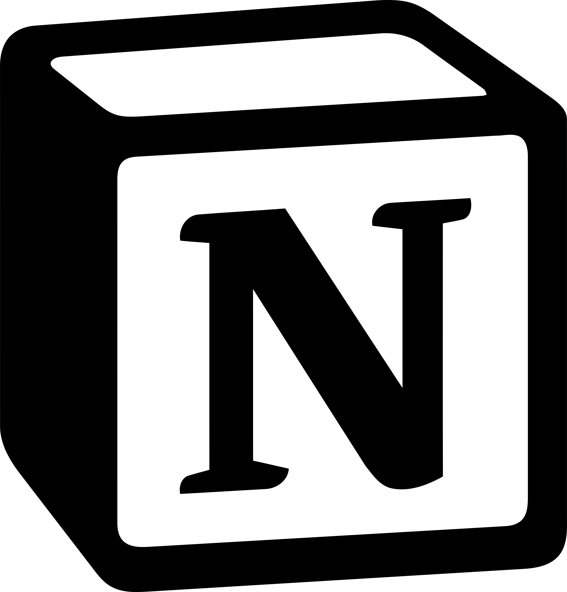
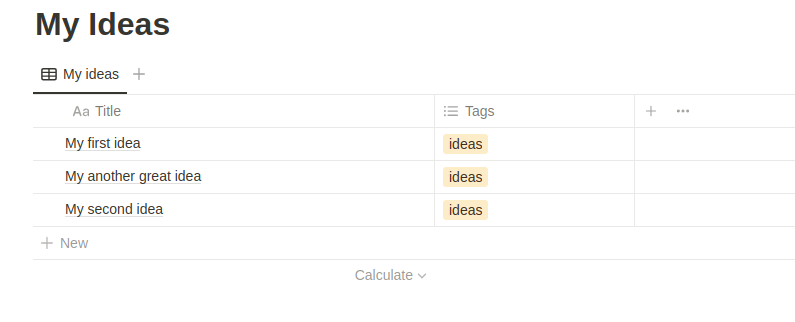

  

  

## UNotion+ ##

This is an extension for [ULauncher](https://ulauncher.io/). Based on [Unotion extension](https://github.com/sergius02/ulauncher-unotion).

### Save your notes to Notion.so. 
### See last 10 items from connected Notion database.

## Dependencies

This extensions needs `requests` and `PyGObject`, install it with pip3

* `pip3 install requests`
* `pip3 install PyGObject`

## Requirements

1. Create a database in Notion
2. Add a property with name "Title" of type "text" (property name can be changed in extension settings)
3. OPTIONAL: create property with name "Tags" of type "multiselect" (property name can be changed in extension settings) 
4. Then you need to create an integration [here](https://www.notion.so/my-integrations), and connect it to your database
5. Put the token in the UNotion extension settings in ULauncher

### Syntax examples

My new note without tags!

My new note with tags! #tag1 #tag2

----------